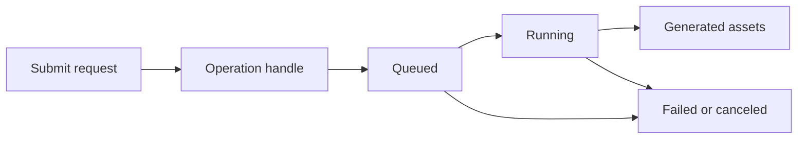

# Roadmap: generation clients

## Goal

Expand Penghou.Baize beyond conversational completion APIs with first-class
support for providers that generate images, video, audio, and other artifacts.

Baize should remain a focused interoperability library rather than becoming a
generic AI framework. It should normalize genuinely shared behavior while
preserving access to provider-specific capabilities.

The intended capability families are:

```text
Completion and streaming (ILlmClient)
Native batch execution (IBaizeBatchClient)
Artifact generation transport (future IGenerationClient)
Generation lifecycle execution (future IGenerationExecutor)
```

Potential generation providers include Runway, fal.ai, Replicate, Black Forest
Labs, Luma, Kling, MiniMax, Recraft, and Ideogram.

## Why generation is separate from completion

A completion commonly has a request/response or incremental-stream lifecycle.
Media generation is commonly a long-running remote operation:



Generation introduces concerns that do not naturally belong on `ILlmClient`:

- resumable operation identity;
- queue and progress state;
- capability-aware cancellation;
- temporary generated assets;
- provider-specific model parameters;
- idempotent submission of potentially expensive work;
- polling, callbacks, or provider-specific streaming.

Generation will therefore be a separate Baize capability, not an extension of
the conversational request model.

## Boundary with multimodal chat

Generation does not replace multimodal chat. It expresses a different caller
intent.

`ILlmClient` remains the correct abstraction for conversational operations such
as asking a model to analyze an image, understand audio, accept a video as
context, or participate in a realtime voice conversation. Its image, audio,
video, file, and other multimodal content types remain part of Baize.

`IGenerationClient` becomes the recommended abstraction when the caller's intent
is to create, edit, transform, upscale, or produce variations of an artifact.

```text
"Describe this image"        -> ILlmClient
"Create an image"            -> IGenerationClient

"Transcribe this recording"  -> ILlmClient or a future transcription capability
"Create narrated audio"      -> IGenerationClient
```

The distinction is independent of provider wire protocol. A provider may use a
chat-shaped API internally while Baize exposes its explicit image-generation
behavior through `IGenerationClient`. The same provider package may implement
several capability interfaces:

```text
Penghou.Baize.Gemini
|-- GeminiChatClient
|-- GeminiGenerationClient
`-- GeminiBatchClient
```

Existing chat behavior remains compatible while generation support matures.
Once the generation API is stable, documentation should recommend it for
explicit artifact creation. Only chat APIs dedicated solely to artifact
generation should be considered for obsolescence, and only when callers have a
mechanical migration path. General multimodal chat content must not be marked
obsolete.

### Artifact-only chat API inventory

This is the Phase 1 inventory of chat-shaped endpoints that exist solely to
generate artifacts. It is reviewed whenever a provider package changes, and it
stays current with the experimental generation adapters:

- **No Baize provider chat client exposes artifact generation through
  `ILlmClient`.** `OpenAiChatClient`, `ClaudeChatClient`, `GeminiChatClient`,
  and `OllamaChatClient` are conversation-only.
- **Gemini Interactions API image generation** (`POST /v1beta/interactions`
  with image-capable models such as `gemini-3.1-flash-lite-image`) is reached
  only through the opt-in live probe in
  `tests/Penghou.Baize.IntegrationTests/GeminiGenerationProviderProbeTests.cs`,
  never through a public `ILlmClient` member. It is compatibility evidence for
  the future Gemini generation adapter and is deliberately not obsoleted.
- **OpenAI image endpoints** (`/images/generations`, `/images/edits`) are
  already exposed only through `OpenAiGenerationClient`, never through chat.
- **OpenAI chat-capable image models** (for example `gpt-image-1`) are not
  surfaced as chat; image generation is offered only through
  `IGenerationClient`.

Consequence: no existing chat member is obsolete and no migration is required
yet. Chat-shaped artifact endpoints should move behind `IGenerationClient`
when an adapter exists; general multimodal chat content stays on `ILlmClient`.

## Design principles

### Provider first, shared abstraction second

The common API must be based on real provider behavior. Existing Baize providers
that support artifact generation should supply the first experimental adapters.
Runway will then test the same contracts against a genuinely asynchronous task
lifecycle. A contrasting provider such as fal.ai or Replicate must validate the
abstraction before it is declared stable.

Runway offers a clear task lifecycle and several media modalities. fal.ai is a
useful contrast because it offers synchronous, queued, streaming, WebSocket, and
webhook execution styles. Replicate is useful because individual models expose
highly variable input schemas.

Shared contracts may be introduced as experimental while these providers are
being built. They should remain free to change until synchronous, chat-shaped,
and queued provider styles work through the same surface.

### Preserve provider fidelity

Baize should provide a consistent lifecycle where one exists without reducing
providers to their lowest common denominator. Provider packages may expose
strongly typed native request types, model-specific options, task metadata, and
capabilities beyond the common interface.

### Keep the provider layer small

Provider packages are responsible for translating requests, submitting work,
reading current state, retrieving results, and requesting cancellation when the
provider supports it.

Durable persistence, scheduled polling, orchestration, workflow recovery, and
application-specific callback handling do not belong in provider packages.

### Do not promise unsupported behavior

Cancellation, progress, callbacks, streaming, and input transports vary by
provider and model. The common API must advertise these through capabilities
rather than implying universal support.

### Keep expensive submission safe

Retrying a timed-out generation request can create duplicate billable jobs.
Idempotency support and ambiguous-submission diagnostics must be designed before
automatic submission retries are introduced.

## Explicit non-goals

The first generation release will not:

- provide durable workflow execution;
- automatically download or persist generated assets;
- hide every provider-specific parameter;
- normalize webhook hosting or verification;
- expose a universal editing graph for every media modality;
- introduce modality-specific NuGet packages;
- retrofit batch and generation into a shared inheritance hierarchy;
- remove multimodal input or response content from `ILlmClient`;
- make workflow infrastructure a dependency of provider clients.

## Provisional domain model

The following types illustrate the required concepts. Their exact public shape
will be decided from the provider implementations.

### Operation identity

An operation ID may only be meaningful for a particular provider, endpoint,
model, or operation kind. Resumable work should therefore use a handle rather
than passing a bare string through the provider-neutral API.

```csharp
public sealed record GenerationOperationHandle(
    string Provider,
    string EndpointId,
    string Id,
    string? Model = null);
```

Provider-native clients may still accept their native task identifier directly.

### Operation state

```csharp
public enum GenerationOperationState
{
    Unknown,
    Queued,
    Running,
    Succeeded,
    Failed,
    Canceled
}
```

`Unknown` prevents Baize from silently misclassifying a new or ambiguous
provider state.

An operation snapshot may eventually resemble:

```csharp
public sealed record GenerationOperation(
    GenerationOperationHandle Handle,
    GenerationOperationState State,
    GenerationResult? Result = null,
    BaizeError? Error = null,
    double? Progress = null,
    IReadOnlyDictionary<string, object?>? ProviderMetadata = null);
```

Progress remains optional. Provider metadata preserves useful information that
does not belong in the common model.

### Generated assets

Generation can return multiple outputs. An asset should carry a source rather
than requiring every result to be a permanent URI. Providers may return:

- a temporary or permanent URI;
- inline data;
- a provider-owned file identifier;
- several renditions or variations.

The common representation should build on concepts similar to Baize's existing
media sources:

```csharp
public sealed record GeneratedAsset(
    GeneratedAssetSource Source,
    string? ContentType = null,
    string? FileName = null,
    long? Size = null,
    DateTimeOffset? ExpiresAt = null,
    IReadOnlyDictionary<string, object?>? Metadata = null);

public sealed record GenerationResult(
    IReadOnlyList<GeneratedAsset> Assets,
    IReadOnlyDictionary<string, object?>? Metadata = null);
```

The concrete source hierarchy will be designed from provider responses. Baize
will not download assets automatically. Callers must also be able to determine
when a signed output URL is temporary.

### Client contract

The eventual provider-neutral surface may resemble:

```csharp
public interface IGenerationClient
{
    GenerationCapabilities Capabilities { get; }

    Task<GenerationOperation> SubmitAsync(
        GenerationRequest request,
        CancellationToken cancellationToken = default);

    Task<GenerationOperation> GetAsync(
        GenerationOperationHandle handle,
        CancellationToken cancellationToken = default);

    Task<GenerationOperation> CancelAsync(
        GenerationOperationHandle handle,
        CancellationToken cancellationToken = default);
}
```

This is deliberately provisional. Cancellation may instead become a small
optional interface if provider implementations show that capability checks are
not sufficiently clear.

Separate request types such as `VideoGenerationRequest`,
`ImageGenerationRequest`, and `AudioGenerationRequest` are preferable to one
unbounded property bag. Separate client interfaces should only be introduced if
real implementations demonstrate a practical need.

The provider client is a transport and control-plane abstraction. A synchronous
provider can return an operation that is already `Succeeded`; a queued provider
can return `Queued` with a resumable handle. The caller does not need to know
which wire protocol produced the snapshot.

### Executor contract

Waiting for completion, selecting a provider, and applying lifecycle policy
belong above the provider client. A convenience executor may eventually expose:

```csharp
public interface IGenerationExecutor
{
    Task<GenerationResult> GenerateAsync(
        GenerationRequest request,
        CancellationToken cancellationToken = default);
}
```

The first executor should be in-process and non-durable. It can route the initial
submission, poll with backoff, report progress, enforce a timeout, and retrieve
the final result. Later, a durable implementation may preserve the same
application-facing contract while using workflow infrastructure internally.

The executor must not hide important lifecycle facts. Diagnostics and optional
progress callbacks should expose the selected endpoint, accepted operation,
state transitions, retries, fallback decisions, and terminal result.

## Cross-cutting requirements

Generation support should follow the conventions already established by Baize.

### Capabilities

Capabilities should describe at least:

- output modalities;
- accepted input modalities and transports;
- cancellation support;
- progress support;
- synchronous and queued execution;
- provider streaming or event support;
- relevant model constraints where they can be expressed reliably;
- idempotent-submission and operation-retrieval support.

Capabilities must be truthful for the configured endpoint and model. They may
later allow the router to filter generation endpoints before applying a routing
policy.

### Errors

Provider errors should map to a stable taxonomy while preserving the provider's
code and useful metadata. Important categories include:

- invalid requests and unsupported parameters;
- authentication and authorization;
- quota and rate limits;
- moderation or safety rejection;
- transient provider availability;
- terminal generation failure;
- unknown submission outcome after a connection failure.

The existing `BaizeError` should be reused unless provider implementations prove
that generation requires a different contract.

### Idempotency and retry

Provider-native idempotency keys should be supported whenever available. The
client must distinguish a safely retryable status request from an ambiguous
submission failure. Generic HTTP retry policies must not automatically replay
expensive submissions unless duplication is prevented.

### Routing and fallback

Generation routing should filter endpoints by request requirements before a
replaceable routing policy ranks them. Requirements may include output modality,
input modality, reference-image support, editing, aspect ratio, resolution,
duration, media format, cancellation, and idempotent submission.

Fallback is safe only before an operation has been accepted, or when an
idempotency mechanism makes resubmission safe. It may be appropriate when an
endpoint cannot satisfy the request, rejects it for capacity or rate limiting
before acceptance, or is conclusively unavailable.

Fallback is unsafe after acceptance and potentially unsafe when submission
timed out with an unknown outcome. A second provider call could create a
duplicate billable job. Moderation, validation failures, slow accepted jobs, and
subjective output quality must not trigger automatic provider fallback by
default.

Once submission succeeds, the operation handle pins every status and
cancellation request to the selected endpoint. Later routing decisions must not
move an accepted operation to another provider.

### Diagnostics, telemetry, and logging

Diagnostics should be opt-in and use the existing Baize approach. Safe signals
include provider, model, operation ID, state transitions, duration, progress,
rate-limit information, failure kind, and asset count.

Prompts, input media, generated media, credentials, signed URLs, and provider
payloads must not be emitted to logs or telemetry by default. Bounded raw HTTP
capture may be enabled explicitly for troubleshooting.

### Dependency injection and provider discovery

Generation provider packages should use the same configuration, secret
resolution, validation, diagnostics decoration, and provider-discovery patterns
as the existing Baize client packages where those patterns apply.

### Testing

Each provider needs deterministic protocol tests for serialization, state
mapping, errors, cancellation, capability boundaries, malformed responses, and
ambiguous submission failures.

Opt-in live integration tests should validate real provider behavior without
running in normal CI. They should use explicit environment switches, conservative
spending limits, minimal outputs, diagnostics capture, and cleanup where the
provider supports deletion or cancellation.

## Microsoft.Extensions.AI compatibility

Baize should continue adapting `ILlmClient` to
`Microsoft.Extensions.AI.IChatClient` for multimodal conversation. The
generation surface should separately integrate with the relevant
Microsoft.Extensions.AI generation abstractions as they mature.

`IImageGenerator` is experimental at the time of this roadmap. Baize can provide
an experimental adapter without making that external interface the foundation
of its provider-neutral generation contracts. Audio and video generation may
need Baize-native contracts until corresponding ecosystem abstractions become
stable and sufficiently expressive.

This preserves framework interoperability while keeping Baize's core model
host-independent.

## Relationship with batch execution and workflows

Batch, generation, and orchestration overlap in infrastructure but represent
different concepts:

```text
Batch:        execute many inference requests
Generation:   produce one or more artifacts
Orchestration: coordinate generation, evaluation, selection, and refinement
```

Generation has three distinct multi-output patterns.

### Native candidate generation

A provider may accept one request with a candidate count and return several
assets. This remains one generation operation. Baize should use it when the
provider supports the requested count and constraints.

### Logical generation batch

When one operation cannot produce all requested outputs, a generation batch
coordinator may split the workload across several operations. It should handle
bounded concurrency, provider limits, partial success, per-operation handles,
cost and quota constraints, cancellation, and idempotent retries.

The existing chat-oriented batch contracts should not be forced to accept
generation requests. Planning, aggregation, polling, and telemetry
infrastructure may be generalized internally after both use cases are understood.

### Best-of-N workflow

"Generate 100 images and select the best" is not merely a batch. It is a
workflow that may generate candidates, validate assets, rank them with a model
or human reviewer, reject duplicates, refine finalists, and upscale the winner.

Baize should provide the generation and logical-batch primitives. Evaluation and
selection policy belongs in replaceable application logic or a higher-level
workflow component.

Batch and generation should not inherit from each other or be forced behind a
generic public operation interface merely because both expose status APIs.

## Package direction

Near term:

```text
Penghou.Baize
Penghou.Baize.Batch
Penghou.Baize.Extensions.AI
Existing provider generation adapters
```

After common behavior has been validated:

```text
Penghou.Baize
Penghou.Baize.Batch
Penghou.Baize.Generation
Penghou.Baize.Runway
Penghou.Baize.Fal or Penghou.Baize.Replicate
```

`Penghou.Baize` already serves as the small common-contract package. A separate
`Penghou.Baize.Abstractions` package should only be introduced if a concrete
dependency problem justifies the migration.

Avoid modality-specific packages unless package size, dependencies, or provider
APIs create a compelling practical reason.

## Implementation phases

### Phase 1: preserve chat and define the boundary

Status: complete. Chat behavior is unchanged and covered by the existing test
suite. The boundary is documented in
[scope and boundaries](scope-and-boundaries.md) and the inventory above
records the artifact-only chat endpoints found today. No chat member was
obsoleted.

Keep current multimodal chat behavior working. Document the distinction between
media used in conversation and explicit artifact generation. Inventory any
chat APIs that exist solely to generate artifacts, but do not obsolete them yet.

### Phase 2: provider comparison and experimental contracts

Status: contracts introduced; matrix in progress. The experimental
request, operation, capability, and asset contracts live in
`Penghou.Baize.Generation` and are exercised by the OpenAI adapter. The
provider comparison is being recorded in the [generation contract
matrix](generation-contract-matrix.md); OpenAI, Gemini (probe), Runway, and
fal.ai are captured, with a second contrasting provider to follow.

Create a contract matrix for generation-capable existing providers, Runway, and
at least one contrasting provider. Record operation states, synchronous and
queued behavior, idempotency, cancellation, progress, inputs, outputs, errors,
rate limits, candidate counts, and asset URL expiry.

Introduce the smallest experimental request, operation, capability, and asset
contracts needed to implement the first provider. Separate image, video, and
audio request types are initial candidates.

### Phase 3: generation through an existing provider

Status: complete. The OpenAI adapter implements image, image-edit, video,
and speech generation with deterministic tests (77 passing on .NET 8 and 10).
The opt-in live probe (`OpenAiGenerationLiveTests`) drives the real
`IGenerationClient` through DI for all four modalities — text-to-image, image
editing, queued video polling, and speech — and the first-class
[OpenAI provider guide](providers/openai.md) documents the generation surface.

Implement `IGenerationClient` for one existing Baize provider. This validates
explicit generation intent, synchronous completion, assets, errors, diagnostics,
and capabilities without first designing around a workflow API.

Add deterministic tests and inexpensive opt-in live tests for the provider's
default generation case.

### Phase 4: second existing provider and Extensions.AI adapter

Status: complete. The Gemini generation client implements text-to-image and
image-to-image through the Interactions API with deterministic and conformance
tests (85 passing). The experimental `Microsoft.Extensions.AI.IImageGenerator`
adapter (`BaizeImageGenerator` in `Penghou.Baize.Extensions.AI`) maps prompts,
reference images, candidate counts, sizes, and output media types to Baize
requests and back to `DataContent`/`UriContent`/`HostedFileContent`, with five
deterministic tests.

Implement a differently shaped existing provider where possible. Add an
experimental `Microsoft.Extensions.AI.IImageGenerator` adapter while preserving
Baize-native contracts for broader modalities.

Compare both implementations before expanding the common surface.

### Phase 5: in-process executor and generation routing

Status: complete. `IGenerationExecutor` and an in-process `GenerationExecutor`
live in `Penghou.Baize.Generation` in the core package. The executor filters
registered endpoints through `GenerationRequestValidator`, selects one via the
replaceable `IGenerationRoutingPolicy` (deterministic first-fit default),
submits exactly once, pins the handle, polls with backoff, reports provider
progress, retries only safe status reads, and enforces a configurable timeout.
`TimeoutExceeded` and `Canceled` were added to `GenerationErrorKind` so queued
lifecycle outcomes are classified truthfully. Nine deterministic tests cover
routing, immediate and queued completion, progress, transient status retries,
timeout, failed/canceled operations, ambiguous submissions (never replayed),
and DI registration.

Add `IGenerationExecutor` with an in-process implementation. It should select an
endpoint, submit once, pin the returned handle, poll with backoff, report
progress, enforce a timeout, and retrieve final assets.

Add capability-based routing and only safe pre-acceptance fallback. Routing
policy must remain replaceable. Unknown submission outcomes must be surfaced
rather than retried blindly.

### Phase 6: provider-native Runway client

Status: complete. `Penghou.Baize.Runway` implements text-to-video and
image-to-video through the Runway Developer API (`/v1/text_to_video` and
`/v1/image_to_video`) with provider-faithful `RunwayTextToVideoRequest`,
`RunwayImageToVideoRequest`, `RunwayTask`, and `RunwayTaskCreateResponse` wire
types. The `RunwayGenerationClient` adapts the asynchronous task lifecycle to
`IGenerationClient`: creation returns a queued operation with a pinned handle,
`GetAsync` polls `GET /v1/tasks/{id}` mapping `PENDING`/`THROTTLED`,
`RUNNING`, `SUCCEEDED`, `FAILED`, and `CANCELLED` to lifecycle states with
progress, cost, and failure-code metadata, and `CancelAsync` issues `DELETE
/v1/tasks/{id}`. Image-to-video accepts URI and inline (data-URI) first frames;
ratio, duration, seed, output format, audio, and negative-prompt parameters map
from `VideoGenerationRequest`. An end-to-end executor test proves the genuinely
queued, long-running path: the `IGenerationExecutor` submits once, polls a
recorded `THROTTLED → RUNNING → SUCCEEDED` sequence, and reports progress. 35
deterministic tests pass on .NET 8 and 10. Opt-in live tests (`RunwayGenerationLiveTests`)
drive queued text-to-video through `IGenerationExecutor` against the real API
when `BAIZE_LIVE_PROVIDER=Runway` and `BAIZE_LIVE_TEST_GENERATION=1` are set, and
upload-hosted files are wired through the uploads API: `RunwayGenerationClient`
reserves an ephemeral upload, posts the file bytes to the presigned URL, and
submits the resulting `runway://` URI as the prompt image for provider-owned
file inputs.

Create `Penghou.Baize.Runway` with provider-faithful request and task types, then
adapt it to `IGenerationClient`. Initial responsibilities are:

- text-to-video;
- image-to-video;
- task retrieval;
- generated-output retrieval;
- cancellation where supported;
- idempotency and ambiguous-submission handling;
- strongly typed error mapping;
- DI, configuration, diagnostics, and telemetry;
- deterministic tests and opt-in live tests.

Runway validates whether the operation and executor contracts work for genuinely
queued, long-running generation.

### Phase 7: logical generation batching

Status: complete. Native candidate counts were already supported from Phase 3
(the `Count` property, `GenerationFeature.MultipleCandidates`, and
`MaximumCandidates`). On top of that, a logical batch executor
(`IGenerationBatchExecutor`/`GenerationBatchExecutor` in the core package) now
replicates a base request across a requested total count, splits it into chunks
bounded by the endpoint's native `MaximumCandidates` (reusing native
multiple-candidate submissions where supported, one-per-chunk otherwise), and
is queue-aware: every chunk is submitted in a first pass with bounded
concurrency so a queued provider receives the whole batch up front, then the
pinned handles are polled in concurrent waves (reporting aggregate progress,
retrying only safe status reads, and enforcing the executor timeout) until each
reaches a terminal state; providers that return a terminal operation from
submission skip the poll phase entirely. `GenerationBatchResult` exposes
explicit partial results: every chunk's `Result`/`Error` plus aggregated
`Assets` and `Errors`, so a quota-limited or transiently failing chunk never
hides the successful candidates. Per-chunk submission is at most once (unknown
submission outcomes are never replayed). Seventeen deterministic tests cover
native-limit chunking, per-request chunking, single submissions, non-image
requests, mixed partial failures, overall progress (including a terminal 1.0
report), submit-all-before-poll ordering, assets across chunks, transient and
non-retryable status-read failures, queued timeouts, no-endpoint routing,
invalid inputs, and DI registration. A runnable best-of-N sample
(`samples/Penghou.Baize.BestOfN`) generates twelve candidates through the batch
executor, scores them with an application-level selection policy, and selects
the best — keeping selection policy out of provider clients using an
in-process client so it runs with no network or API key.

Support native candidate counts first. Then add logical generation batching for
larger workloads using bounded concurrency and explicit partial-result semantics.

Build a best-of-N sample or higher-level component to validate that generation,
batching, evaluation, and refinement compose cleanly without putting selection
policy into provider clients.

### Phase 8: contrasting queued provider

Status: complete. `Penghou.Baize.Fal` implements a fal.ai queue adapter
(`POST {base}/{model}` for submission, `GET .../requests/{id}/status` for
status, `GET .../requests/{id}` for the result document, and
`PUT .../requests/{id}/cancel` for cancellation). It deliberately contrasts
with Runway to stress the shared contracts: the input is arbitrary per-model
JSON (Baize maps the common surface to a conventional fal payload and posts any
model-faithful `JsonObject` unchanged through the native `SubmitQueueAsync`),
the queue reports a `position` instead of a numeric fraction (surface via
provider metadata, no numeric progress), output assets are storage-backed URLs
extracted from an arbitrary result document by a shape-agnostic recursive walk,
and cancellation uses a `PUT` verb rather than a `DELETE`. A `COMPLETED`
status is followed by a separate result fetch, keeping submit/status/result
separation explicit. Fifty-two deterministic client and executor/DI tests
cover the queued lifecycle, error-document variants, content-type inference,
capability gates, and operation recovery through `IGenerationExecutor`;
measured package coverage is 97% line / 97% branch.

Implement enough of fal.ai or Replicate to exercise another asynchronous or
highly model-variable execution style. Use it to challenge cancellation,
progress, arbitrary inputs, asset sources, and operation recovery.

### Phase 9: stabilization and migration guidance

Status: complete. The generation client surface has been stabilized through
extensive testing and review across synchronous, chat-shaped, and queued providers.

Key findings from the stabilization review:

- **Diagnostics**: Generation clients now emit `Activity` traces and `Meter`
  counters (`baize.gen.requests`, `baize.gen.failures`, `baize.gen.duration`)
  alongside the existing `baize.llm.*` telemetry. Activity names use
  `llm.generation` with tags `gen_ai.operation.name` (submit/status/cancel),
  `gen_ai.provider.name`, and `gen_ai.request.model`. No provider payloads are
  leaked in tags or metrics.

- **Provider metadata consistency**: Fal renamed `request_id` → `provider_id`
  in `ProviderMetadata`; OpenAI video removed the `raw` field from metadata
  (unbounded payload leak). All four providers now emit consistent keys:
  `status`, `provider_id`.

- **Error taxonomy**: `BaizeException.ClassifyStatusCode` now maps HTTP 408
  (Request Timeout) to `ProviderUnavailable` so transient status-read
  timeouts are retried by the executor, matching the definition-of-success
  criterion "diagnostics explain lifecycle and failure behavior".

- **Idempotency defaults**: OpenAI `OpenAiGenerationOptions` default features
  now include `GenerationFeature.Cancellation` (video cancellation is
  implemented but was not advertised by default). No redundant generation-specific
  chat members were found — explicit artifact requests are never routed through
  chat in this codebase, so nothing was obsolete.

- **No redundant chat members**: The chat surface (`ILlmClient`) remains purely
  conversational; explicit artifact generation was never routed through chat.
  No obsolete members were identified.

Stabilization criteria met:

- ✅ Synchronous, chat-shaped, and queued providers implement the common surface
- ✅ Multimodal chat remains compatible and clearly separated from generation
- ✅ Submissions can be resumed safely from persisted handles
- ✅ Unsupported capabilities fail predictably before unnecessary provider calls
- ✅ Ambiguous submissions cannot be blindly retried into duplicate billable jobs
- ✅ Generated assets preserve their source, metadata, and expiry information
- ✅ Routing falls back only before acceptance or under safe idempotency guarantees
- ✅ Native candidates and logical generation batches have explicit semantics
- ✅ Diagnostics explain lifecycle and failure behavior without leaking payloads
- ✅ Deterministic tests cover protocol edge cases
- ✅ Phase 8 live tests confirm default provider behavior
- ✅ Provider-native features remain accessible alongside the common API

Remaining follow-ups (Phase 10 / future):

- **Phase 10: additional providers** — prioritize providers that add meaningful
  capabilities or expose distinct execution models.
- **Future possibility: durable execution** — persistent workflow, scheduled
  polling, restart recovery, and safe transient retries could be provided by a
  separate optional executor implementation (e.g., Temporal), keeping the core
  client usable in ordinary .NET applications without a database or queue.
- **Diagnostics enrichment** — consider adding usage metrics (input/output tokens)
  for generation calls, consistent with the existing `baize.llm.*` telemetry.

> **The guiding rule is:**
>
> > Preserve chat for conversation, use generation for artifact intent, keep
> > provider clients small, and move lifecycle orchestration above them.
